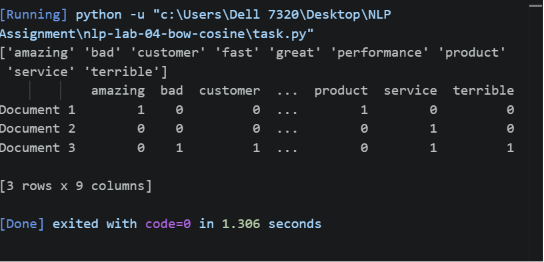
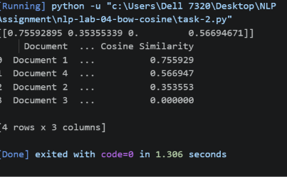

# NLP Lab 04 — Bag of Words & Cosine Similarity

**Course:** CS-602 / DS-604 — Natural Language Processing
**Topic:** Vector Space Modeling — Bag of Words (BoW) & Cosine Similarity
**Institute of Mathematics & Computer Science, University of Sindh, Jamshoro**
**SHOUKAT (2K24/AI/91)**

---

## Task 1: Bag of Words Matrix Construction

**Scenario:** Three customer reviews are converted into a term-frequency matrix using `CountVectorizer` with English stop words removed.

```python
import pandas as pd
from sklearn.feature_extraction.text import CountVectorizer

corpus = [
    "The product performance is amazing and fast",
    "The service was fast and performance was great",
    "Terrible customer service and bad performance"
]

vectorizer = CountVectorizer(stop_words='english')
bow_matrix = vectorizer.fit_transform(corpus)

vocabulary = vectorizer.get_feature_names_out()
print(vocabulary)

bow_df = pd.DataFrame(
    bow_matrix.toarray(),
    columns=vectorizer.get_feature_names_out(),
    index=[f"Document {i+1}" for i in range(len(corpus))]
)
print(bow_df)
```

**Output:**



The 9-word vocabulary extracted (stop words like "the", "is", "and", "was" removed) is:
`amazing, bad, customer, fast, great, performance, product, service, terrible`

---

## Task 2: Document Search Engine & Relevance Ranking

**Scenario:** A mini search engine ranks four documents against a query using cosine similarity.

```python
import pandas as pd
from sklearn.feature_extraction.text import CountVectorizer
from sklearn.metrics.pairwise import cosine_similarity

documents = [
    "Machine learning algorithms analyze structured data effectively",
    "Deep learning and neural networks excel at processing unstructured data",
    "Natural language processing helps computers understand human language",
    "Python is widely used for machine learning and data science"
]

query = ["machine learning algorithms for data"]

vectorizer = CountVectorizer(stop_words='english')
doc_vectors = vectorizer.fit_transform(documents)
query_vector = vectorizer.transform(query)

similarity_scores = cosine_similarity(query_vector, doc_vectors)
print(similarity_scores)

scores_flat = similarity_scores.flatten()
ranking_df = pd.DataFrame({
    "Document": [f"Document {i+1}" for i in range(len(documents))],
    "Text": documents,
    "Cosine Similarity": scores_flat
})
ranking_df = ranking_df.sort_values(by="Cosine Similarity", ascending=False).reset_index(drop=True)
print(ranking_df)
```

**Output:**



**Ranking:** Document 1 (0.755929) > Document 4 (0.566947) > Document 2 (0.353553) > Document 3 (0.000000)

---

## Lab Viva & Reflection Questions

### 1. Word Order Invariance
"Dog bites man" and "Man bites dog" produce the exact same Bag of Words representation because BoW only counts *how many times* each vocabulary word appears — it discards word order and grammar entirely. Both sentences contain the same multiset of words `{dog, bites, man}`, each appearing once, so their vectors are identical even though their meanings are opposite.

This is a real limitation for sentiment analysis, since sentence structure and negation carry meaning that BoW throws away. For example, "not good, terrible" and "not terrible, good" would look nearly identical to a BoW model despite expressing opposite sentiment, and phrases like "not bad" can even be misread as negative because "bad" is present, ignoring the negating word's effect on meaning.

### 2. Sparsity Issue
As vocabulary size grows toward 100,000 unique words, the BoW matrix becomes extremely **sparse** — each individual document typically only uses a few dozen or few hundred distinct words, so the vast majority of the 100,000 columns in its row are zero. While scikit-learn stores this efficiently in a compressed sparse format (only nonzero entries take memory), converting it to a dense array (e.g. via `.toarray()`) would require memory proportional to `number_of_documents × 100,000`, which becomes impractical very quickly. In short: matrix *density* drops sharply while its theoretical *size* balloons, making dense representations memory-inefficient at scale.

### 3. Zero Similarity
Document 3 ("Natural language processing helps computers understand human language") shares **no non-stopword vocabulary** with the query "machine learning algorithms for data" — none of its content words (natural, language, processing, helps, computers, understand, human) match any query word (machine, learning, algorithms, data). Since cosine similarity's numerator is the dot product of the two vectors, and the dot product sums the products of matching positions, every term in that sum is `0 × something = 0` when there is no shared vocabulary. A zero numerator gives a cosine similarity of exactly **0.0000**, regardless of how long or short either document is — geometrically, the two vectors are orthogonal (at a 90° angle) in the vector space.
